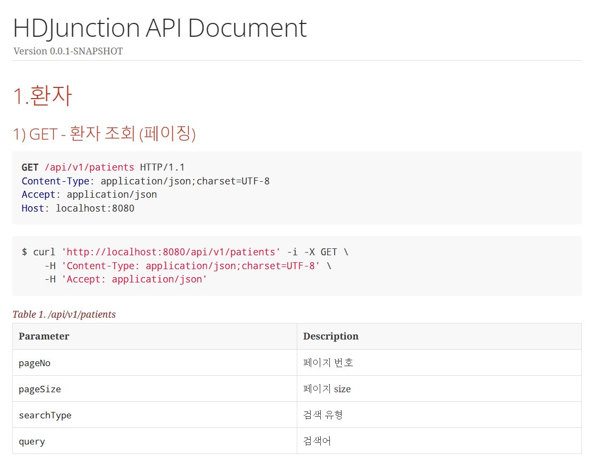
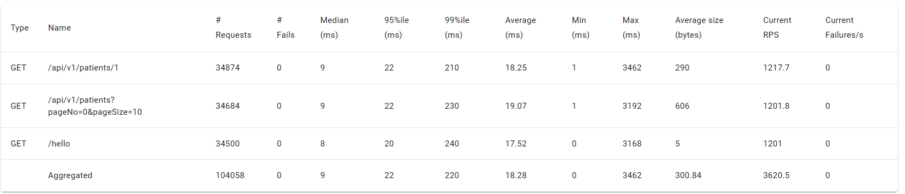
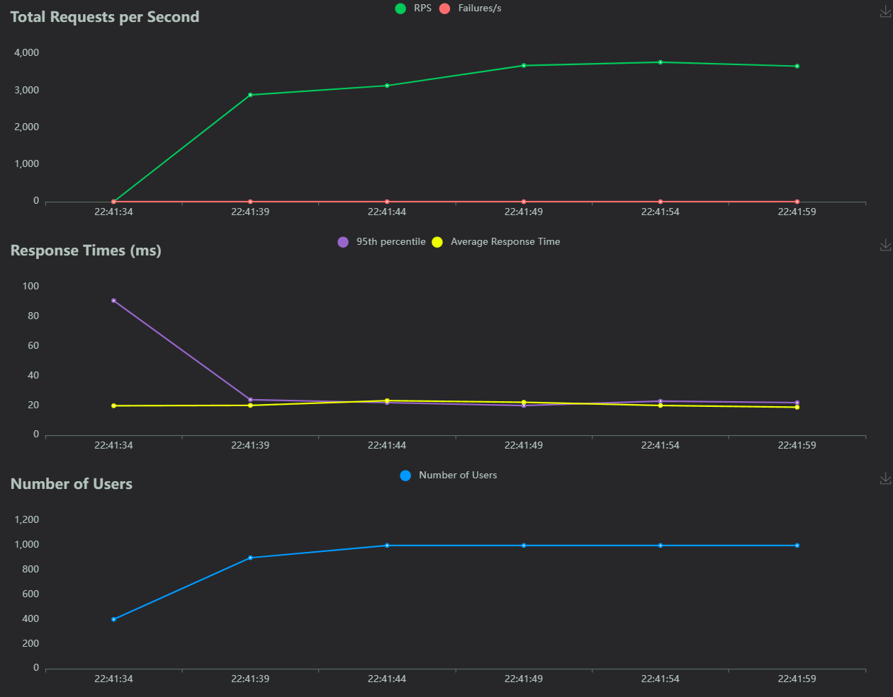

# 백엔드 사전과제 (이진석)

## 🏠 Overview

**소감**

에이치디정션 백엔드 사전과제로 rest api를 개발하였다.

구현 범위는 요구사항 전체를 구현하였고 짧은 시간 프로젝트를 만들면서 스스로에게 좋은 배움의 기회가 된거같다! <br><br>

**요구사항 만족**

요구사항에 맞게 작동하는것이 중요하다고 생각이 들었다.

그래서 기능 요구사항을 면밀히 검토하여 제대로 작동하는 api를 만드는 것을 최우선으로 삼았다. <br><br>

**테스트 가능**

테스트 코드를 작성하여 신뢰도있는 프로젝트를 만들고자 하였다

컨트롤러 테스트, 비지니스 로직 테스트를 겸하여 테스트 코드를 작성하였다.<br><br>


**가독성**

변수명이나 메소드명, 클래스명등 명명 규칙을 가독성있고 이해하기 쉬운 이름을 붙이려고 노력하였다.<br><br>

**멀티 모듈**

프로젝트 모듈을 core와 api로 나누어 느슨하게 결합되도록 의도하였다.

core 모듈은 만약 이 프로젝트에 batch같은 다른 모듈이 들어온다고 할지라도 import 해서 사용이 가능하다
<br><br>

**예외 처리**

예외처리를 적절하게 하여 api에서 해당 예외에 맞는 응답을 줄 수 있도록 advice controller를 활용하였다.<br><br>

**데이터**

java진영의 ORM인 jpa, querydsl을 사용하였다. DB는 로컬테스트가 용이하도록 h2를 사용하였다. <br><br>


**rest docs**

스프링 restdocs를 이용하여 api 문서를 생성하였다.

http://localhost:8080/docs/index.html




## 🏛️ Structure

### Api

어플리케이션의 rest api (api)

**domain**

- Patient
- Visit


### Core

어플리케이션에 필요한 DB 관련 설정을 제공하는 모듈 (core)

db

- domain
    - Hospital
    - Patient
    - PatientVisit
    - CodeGroup
    - Code


## 🎢 Tech Stack

- java 17
- gradle 8.6
- spring boot 3.2.3
- h2
- jpa
- querydsl
- junit5
- spring restdocs
- lombok


## 성능 테스트 (locust)







## 🏃 Run Application
테스트 실행
```shell
./test.sh
```

build파일 삭제
```shell
./clean.sh
```

어플리케이션 실행
```shell
./start.sh
```